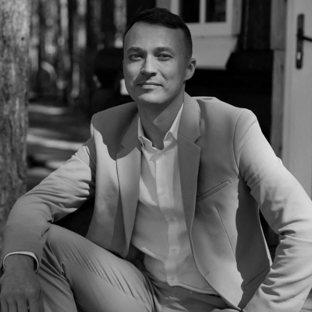

# Привет! 👋 Меня зовут: Лешуков Денис

### Обо мне  
- 🎓 Учусь в НЕТОЛОГИИ на курсе: Python-разработчик
- 💻 Интересуюсь: программированием, дизайном, ИИ, FPV Cinematic, BJJ  
- 🌱 Сейчас изучаю модуль: Git - система контроля версий  

### Мои навыки  
- Чистая установка/переустановка ОС
- Markdown (базовый уровень)
- Python (базовый уровень) 
 

### Контакты  
📧 Email: lobanovsky86@yandex.ru  
🔗 VK: [[ссылка]](https://m.vk.com/bjjdenisleshukov)  

